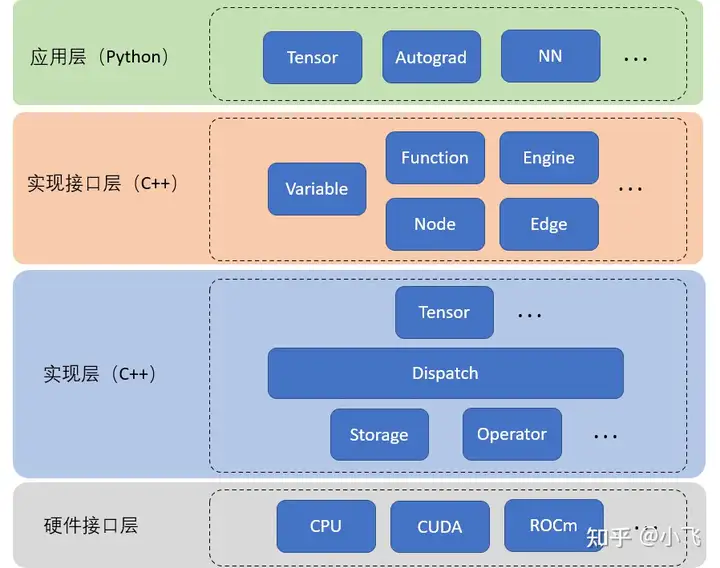

# PyTorch

https://www.cnblogs.com/rossiXYZ?page=6

cpu build aten:

https://pytorch.org/get-started/locally/

see readme for building:

https://github.com/pytorch/pytorch/tree/main

https://blog.csdn.net/qq_42722197/article/details/134432550

PYBIND11_MODULE -- Python 与 C++ 的桥梁
上文说到通过 setup.py 我们编译了扩展文件。可是目前仍然有个疑问，为什么编译出来的 C++ / CUDA 二进制文件可以在 Python 中直接被调用呢？再次检测编译的所有文件，发现其中有个文件 pybind.cpp （https://github.com/open-mmlab/mmcv/blob/master/mmcv/ops/csrc/pytorch/pybind.cpp）十分可疑，其打开后大致形式如下。

#include <torch/extension.h>
// 函数声明，具体实现在其他文件
Tensor nms(Tensor boxes, Tensor scores, float iou_threshold, int offset);
 
 
PYBIND11_MODULE(TORCH_EXTENSION_NAME, m) {
  m.def("nms", &nms, "nms (CPU/CUDA) ", py::arg("boxes"), py::arg("scores"),
        py::arg("iou_threshold"), py::arg("offset"));
}
这里PYBIND11_MODULE是一个宏，定义在 pybind11 库中(见pybind11/include/pybind11/pybind11.h)（https://github.com/pybind/pybind11/blob/master/include/pybind11/pybind11.h）。而 pybind11 是一个用来在 C++ 代码中创建 Python的连接的库。找到了源头，我们进一步分析。

这里PYBIND11_MODULE 的作用是为 C++ 代码接入 Python 解释器提供入口。以上述代码为例， TORCH_EXTENSION_NAME 正是在上文 gcc编译过程中出现的宏，对应为extension的 name 变量。因此在这里会被解释成 _ext（注意没有双引号） 。m 则代表 TORCH_EXTENSION_NAME 所对应的模块实例（实际上可以指定为任何名字）。{}中的每个 m.def都定义了一个 _ext 的成员函数，其一般形式为 m.def("函数名"，具体 C++ 实现的函数指针, "文档", 参数列表)。通过这种形式，nms也就顺利地成为了mmcv._ext的成员函数，其具体实现为已经定义好的 nms 函数（对这个函数的分析我们会在下节讲到）。在 Python 中也就可以运行from mmcv._ext import nms了。如果对这里的定义仍然不清楚，我们可以把该宏用 C++ 编译器展开一下：

Tensor nms(Tensor boxes, Tensor scores, float iou_threshold, int offset);
static void pybind11_init__ext(pybind11::module &); 
extern "C" __attribute__ ((visibility("default"))) PyObject *PyInit__ext() 
{ 
    // 省略部分代码  
    auto m = pybind11::module("_ext");  // m 变量的初始化是在宏内部
    try { pybind11_init__ext(m); return m.ptr(); } 
} 
void pybind11_init__ext(pybind11::module &m) {
   // 添加成员函数
   m.def("nms", &nms, "nms (CPU/CUDA) ", py::arg("boxes"), py::arg("scores"),
       py::arg("iou_threshold"), py::arg("offset"));
}
其中 PyObject *PyInit_ 定义在 Python.h中，正是 C++ 中声明 Python module 的官方方法（可见官方 Python 文档）。这里 PyInit_后接的_ext其实就是 TORCH_EXTENSION_NAME宏解释得到。意味着新声明了一个 名为_ext 的 Python module。

4. cpp/cu文件 -- 算子的具体实现
通过对 PYBIND11_MODULE 的分析后，我们了解了 mmcv._ext.nms 具体的实现是一个声明为 Tensor nms(Tensor boxes, Tensor scores, float iou_threshold, int offset); 的函数。该函数定义在 mmcv/ops/csrc/pytorch/nms.cpp 中（https://github.com/open-mmlab/mmcv/blob/master/mmcv/ops/csrc/pytorch/nms.cpp）

#include <torch/extension.h>
 
 
Tensor nms(Tensor boxes, Tensor scores, float iou_threshold, int offset) {
  if (boxes.device().is_cuda()) {
    // cuda 实现
    return nms_cuda(boxes, scores, iou_threshold, offset);
  } else {
    // c++ 实现
    return nms_cpu(boxes, scores, iou_threshold, offset);
  }
}
可以看到这时实际的实现方式针对设备的不同分为了 nms_cuda 与 nms_cpu 两种。这里我们先来看 cpp 的实现。

4.1 CPP 算子实现
#include <torch/extension.h>
using namespace at; // 适当改写
Tensor nms_cpu(Tensor boxes, Tensor scores, float iou_threshold, int offset) {
  // 仅显示核心代码
  for (int64_t _i = 0; _i < nboxes; _i++) {
    // 遍历所有检测框，称为主检测框
    if (select[_i] == false) continue;
    for (int64_t _j = _i + 1; _j < nboxes; _j++) {
      // 对每个主检测框，遍历其他检测框，称为次检测框
      // 这里只用遍历上三角元素即可，节省计算
      if (select[_j] == false) continue;
      auto ovr = inter / (iarea + areas[j] - inter);
      // 如果次检测框与主检测框 iou 过大，则去除该次检测框
      if (ovr >= iou_threshold) select[_j] = false;
    }
  }
  return order_t.masked_select(select_t);
}

以上即为 nms_cpu 的核心代码，对该算法想要有进一步了解的同学可以参看源码 。这里出现了两个for 循环，实现上这正是我们希望实现 nms 的 C++ / CUDA 扩展的原因。对于有一定 C++ 基础的同学来说代码应该较好理解 （注意这里 int64_t 可理解为C99规约的为支持不同平台的int64类型的 typedef 定义，可直接理解为 int64），但这里同时也出现了一些新的变量类型，最典型的是 Tensor 数据类型。

其实这里 Tensor 数据类型由 torch/extension.h 支持，来源于 pytorch 中 C++ API 中三大 namespace（at, torch 与 c10)中的 at。