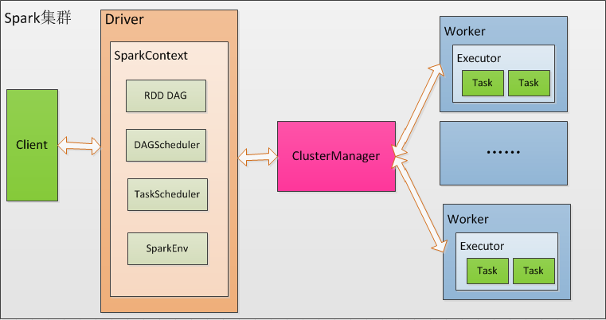
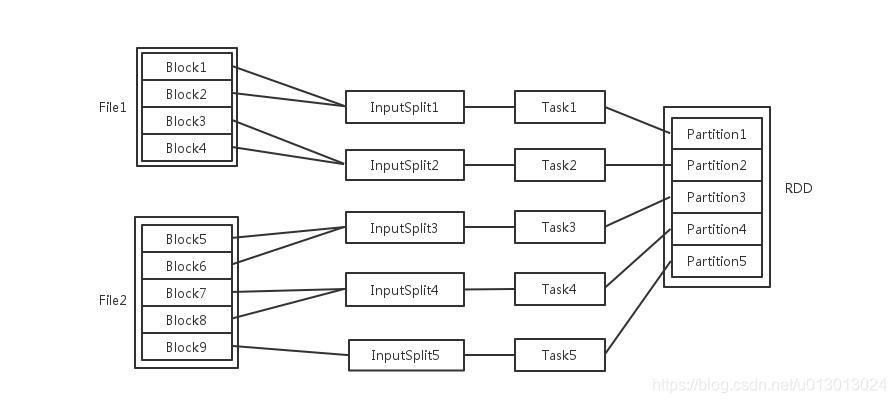

# Spark

## Spark架构中的基本组件

Spark的整体流程为：Client提交应用，Master找到一个Worker启动Driver，Driver向Master或者资源管理器申请资源，之后将应用转化为RDD Graph，再由DAGScheduler将RDD Graph转化为Stage的有向无环图提交给TaskScheduler，由TaskScheduler提交任务给Executor执行。在任务执行过程中，其他组件协同工作，确保整个应用顺利执行。

Spark架构采用了分布式计算中的Master-Slave模型。Master是对应集群中的含有Master进程的节点(ClusterManager)，Slave是集群中含有Worker进程的节点。Master作为整个集群的控制器，负责整个集群的正常运行；Worker相当于是计算节点，接收主节点命令并进行状态汇报；Executor负责任务的执行；Client作为用户的客户端负责提交应用；Driver负责控制一个应用的执行。

Spark集群部署后，需要在主节点和从节点分别启动Master进程和Worker进程，对整个集群进行控制。在一个Spark应用的执行过程中，Driver和Worker是两个重要角色。Driver程序是应用逻辑执行的起点，负责作业的调度，即Task任务的分发，而多个Worker用来管理计算节点和创建Executor并行处理任务。在执行阶段，Driver会将Task和Task所依赖的file和jar包序列化后传递给对应的Worker机器，同时Executor对相应数据分区的任务进行处理。

ClusterManager：在Standalone模式中即为Master(主节点)，控制整个集群，监控Worker。在YARN模式中为资源管理器。

Worker：从节点，负责控制计算节点，启动Executor或Driver。在YARN模式中为NodeManager，负责计算节点的控制。

Driver：运行Application的main()函数并创建SparkContext。

Executor：执行器，在Worker节点上执行任务的组件，用于启动线程池运行任务。每个Application拥有独立的一组Executors。

SparkContext：整个应用的上下文，控制应用的生命周期。

RDD：Spark的基本运算单元，一组RDD可形成执行的有向无环图RDD Graph。

DAGScheduler：实现将Spark作业分解成一到多个Stage，每个Stage根据RDD的Partition个数决定Task的个数，然后生成相应的Task Set放到TaskScheduler中。

TaskScheduler：将任务(Task)分发给Executor执行。

Stage：一个Spark作业一般包含一到多个Stage。

Task：一个Stage包含一到多个Task，通过多个Task实现并行运行的功能。

Transformations：如：map、filter、groupBy、join等。Transformations操作是Lazy的，也就是说从一个RDD转换生成另一个RDD的操作不是马上执行的，Spark在遇到Transformations操作时只会记录需要这样的操作，并不会去执行，需要等到有Actions操作的时候才会真正启动计算过程进行计算。

Actions：如：count、collect、save等。Actions操作会返回结果或把RDD数据写到存储系统中。Actions是触发Spark启动计算的动因。

SparkEnv：线程级别的上下文，存储运行时的重要组件的引用。

SparkEnv内创建并包含如下一些重要组件的引用：

MapOutPutTracker：负责Shuffle元信息的存储。

BroadcastManager：负责广播变量的控制与元信息的存储。

BlockManager：负责存储管理、创建和查找块。

MetricsSystem：监控运行时性能指标信息。

SparkConf：负责存储配置信息。

## Spark 并发

输入可能以多个文件的形式存储在HDFS上，每个File都包含了很多块，称为Block。
当Spark读取这些文件作为输入时，会根据具体数据格式对应的InputFormat进行解析，一般是将若干个Block合并成一个输入分片，称为InputSplit，注意InputSplit不能跨越文件。
随后将为这些输入分片生成具体的Task。InputSplit与Task是一一对应的关系。
随后这些具体的Task每个都会被分配到集群上的某个节点的某个Executor去执行。

每个节点可以起一个或多个Executor。

每个Executor由若干core组成，每个Executor的每个core一次只能执行一个Task。
每个Task执行的结果就是生成了目标RDD的一个partiton。
注意: 这里的core是虚拟的core而不是机器的物理CPU核，可以理解为就是Executor的一个工作线程。

而 Task被执行的并发度 = Executor数目 * 每个Executor核数。

至于partition的数目：

对于数据读入阶段，例如sc.textFile，输入文件被划分为多少InputSplit就会需要多少初始Task。

在Map阶段partition数目保持不变。

在Reduce阶段，RDD的聚合会触发shuffle操作，聚合后的RDD的partition数目跟具体操作有关，例如repartition操作会聚合成指定分区数，还有一些算子是可配置的。

# 参考

https://www.cnblogs.com/huanghanyu/p/12989067.html#_label0_6

https://cloud.tencent.com/developer/article/1911899

https://blog.51cto.com/u_16099215/6927768

https://www.cnblogs.com/huanghanyu/p/12989067.html#_label0_0

https://github.com/lw-lin/CoolplaySpark/blob/master/Structured%20Streaming%20%E6%BA%90%E7%A0%81%E8%A7%A3%E6%9E%90%E7%B3%BB%E5%88%97/1.1%20Structured%20Streaming%20%E5%AE%9E%E7%8E%B0%E6%80%9D%E8%B7%AF%E4%B8%8E%E5%AE%9E%E7%8E%B0%E6%A6%82%E8%BF%B0.md