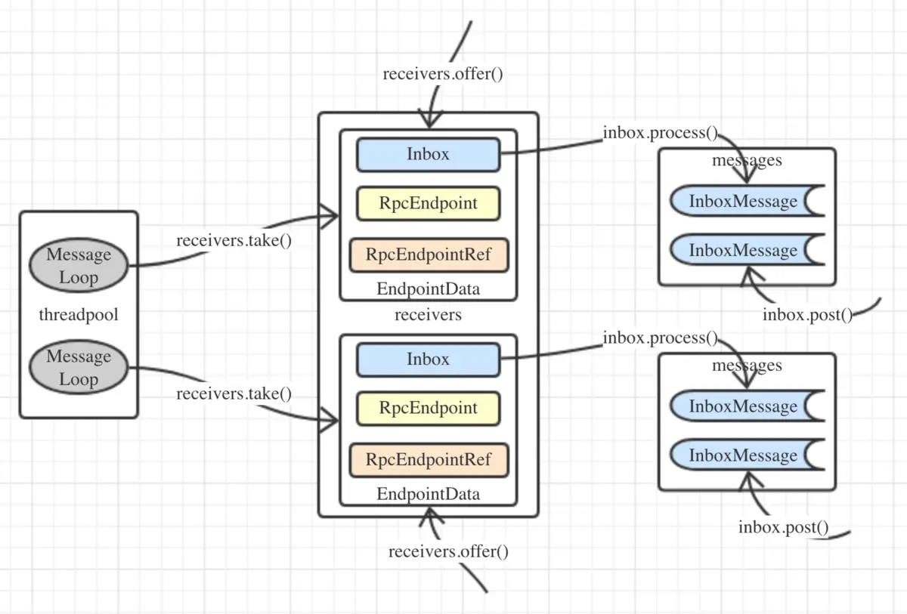

### Dispatcher

在[Spark源码阅读5：RpcEnv](../docs/rpcenv.md)中已经介绍过，Dispatcher是NettyRpcEnv中所包含的组件，用于将消息路由到正确的RPC端点。
它里面的属性不是很多，但是比较重要，我们一个一个的看一看：
  * endpoints/endpointRefs：这是两个ConcurrentHashMap，分别用来维护RPC端点名称与端点数据EndpointData的映射，以及RPC端点与其引用的映射。

  * receivers：存储RPC端点数据的阻塞队列，LinkedBlockingQueue类型，当RPC端点收到要处理的消息时，会将其放入这个队列，空闲的RPC端点无消息可放。

  * threadpool：用来分发消息的固定大小的守护线程池，线程数由spark.rpc.netty.dispatcher.numThreads确定，默认值是2和可用CPU核数两者中的最大值，
  线程池内的线程都是MessageLoop类型的。(最新版3.0中已被替换)

  * EndpointData：是Dispatcher中的私有内部类，实现很简单，接收三个参数：RPC端点名称、RPC端点实例、端点实例的引用，然后创建一个Inbox的实例，Inbox
  是一个"收件箱"，它存储着对应RPC端点所收到且需要处理的消息，这些消息都继承自InboxMessage特征，且向Inbox发送消息是线程安全的。(最新版3.0中已被替换)

前面已经提到Dispatcher的线程池执行的都是MessageLoop，这是一个内部类，本质上是一个线程，不断循环的处理消息。其从reveivers阻塞队列中获取EndpointData，
判断如果是PoisonPill(一种特殊的端点信息，标志着循环的结束)，则在线程结束前会将其重新放回队列中，以结束其它活着的线程；如果不是PoisonPill，则调用
Inbox.process()方法，对该RPC端点收件箱中的消息进行处理。由于take会阻塞的获取消息，所以如果receivers队列为空会阻塞直到有新的EndpointData进入。

Inbox的enableConcurrent属性用于控制是否允许多个线程同时处理Inbox中的消息，如果不允许，且当前活跃线程数不为0，则直接返回。否则，从messages这个链表
中获取消息，同时增加活跃线程数，然后对消息进行模式匹配，根据消息类型的不同调用RpcEndpoint中的对应方法进行处理，如果没有匹配，则通过safelyCall()方法
最终调用RpcEndpoint.onError()进行处理。

需要注意的是，在Inbox.process()方法中(以及Inbox的许多其它方法中)，出现了许多synchronized代码块，这是因为messages是一个普通的链表，线程不安全，所以
对其的操作都需要加锁以避免安全问题。

那么，Inbox中的消息是通过process()方法进行处理，那么消息是从哪里来的呢？我们可以在Inbox的主构造方法中发现，构建Inbox时会自动投递OnStart消息，让
Endpoint做一些准备工作，而Inbox是在new EndpointData时构建的，它是在Dispatcher.registerRpcEndpoint()方法中调用的。同理，在unregisterRpcEndpoint()
方法中，会反向注册RPC端点，然后调用Inbox.stop()方法投递OnStop消息，在停止前做一些清理工作。

此外，在Dispatcher.postMessage()方法中也有向Inbox投递消息的逻辑，该方法根据RPC端点的名称，从endpoints映射中取得对应的EndpointData，如果存在就调用
Inbox.post()方法将消息加入到Inbox中，并将该EndpointData加入阻塞队列，让MessageLoop来处理。

Dispatcher类中还有一些方法也调用了postMessage()方法来发送特定类型的消息，如postOneWayMessage()用来发送OneWayMessage，postLocalMessage()/postRemoteMessage()
来发送RpcMessage等。

Dispatcher的停止是通过调用stop()方法来实现的，它首先会将状态改为停止，然后遍历endpoints映射，对其中的每个RpcEndpoint进行反向注册，最后向receivers阻塞
对列中放入PoisonPill，杀掉线程池中的所有线程，并关闭线程池。

最后还是用一张图来总结一下Dispatcher的工作流程吧。
