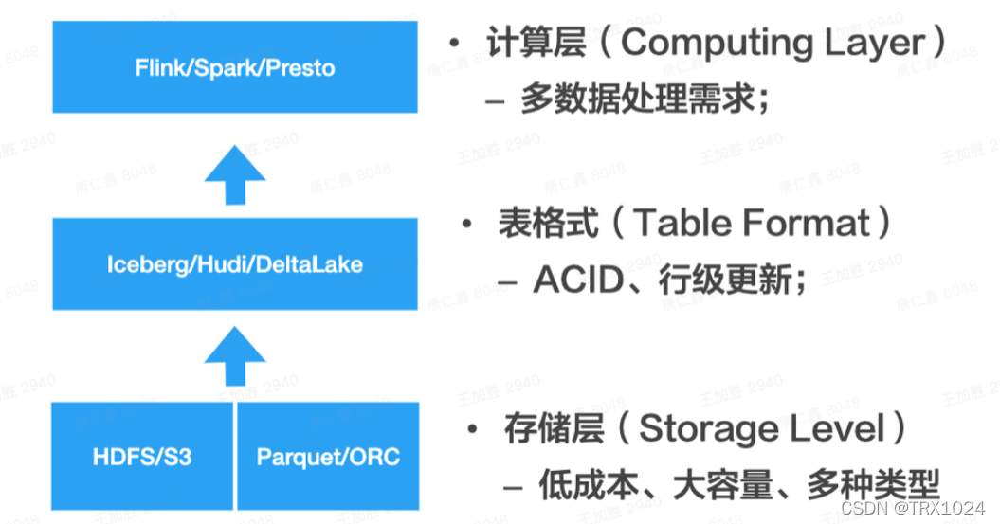

# datalake

- 最底层为存储层：一般依赖HDFS或者公有云存储（比如S3）保存数据；数据格式为开放格式，比如Parquet或者ORC；
- 中间层为数据表抽象层：它的关键作用在于提供了表格式的抽象，比如能够支持ACID；
- 最上层为计算层：基于表抽象层，可以扩展出不同的计算引擎，满足不同的计算需求。
可以看出，由于采用了HDFS或公有云存储，所以数据湖在保存数据上，具有低成本大容量的优点，并且能够保存多种多样的数据，比如结构化、半结构化和非结构化数据；另外，由于表抽象层的存在，保证了ACID事务支持，同时提供了良好的扩展能力，可以面向不同的计算需求对接不同的计算引擎。

## hudi

https://mp.weixin.qq.com/s/DEC4BYjNntpiCe_NFcGS6A

https://cloud.tencent.com/developer/article/2414205

## iceberg

## delta