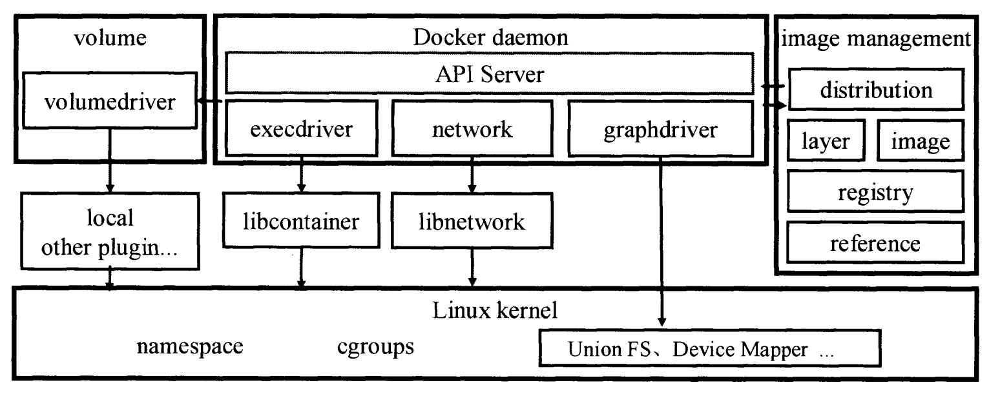

# Docker

Docker使用C/S架构。用户通过Docker client与Docker daemon通信，Docker daemon中有个API Server处理具体请求。而具体到后端的实际操作，Docker则分了很多模块，其中对容器运行时、volume、镜像以及网络方面的具体实现已经放在daemon以外的模块中。

其中execdriver是容器执行驱动，volumedriver是volume存储驱动，graphdriver是镜像存储驱动。

网络部分现在已经分离成一个libnetwork库独立维护。

## client和daemon

client模式的命令基本就是执行对应方法，向daemon发起请求，之后读取docker daemon的返回结果。

daemon首先要启动一个API server，然后创建各种容器配置和环境(/var/lib/docker/)以及网络，最后一个daemon对象诞生。

启动容器再执行下去就是去调用execdriver了，这一块再交由底层模块处理。

## libcontainer
封装实际启动容器的过程。

从逻辑容器到物理容器，会启动两个进程，一个在容器外，一个在容器内，通过pipe进行进程间通信。

容器外进程传递一些配置，比如网络的veth ip进去；容器内进程最后执行CMD或者ENTRYPOINT启动用户的进程。

## 镜像管理
分层存储，写时复制

registry, repository, manifest, image, layer

commit/build构建镜像，save/load镜像, export/import容器, pull/push远程registry

## 存储管理
repository层-image层-layer层

容器文件系统大概可以分为三层：容器读写层-容器init层-只读镜像层

容器init层是为了在容器启动前复制/etc/hosts此类的文件进容器，因为这些文件并不适合保存在只读镜像层中

底层的存储驱动需要实现Docker的接口，目前有aufs、devicemapper、overlay

## 数据卷管理
创建数据卷会在/var/lib/docker/volumes/下面创建一个文件夹，之后通过挂载的方式的给容器内部使用。

直接挂载宿主机的hostPath不会创建数据卷，在容器内部无法删除挂载的文件，只能读写。

如果容器内部存在与挂载文件路径相同的文件，那么会将容器文件隐藏起来，这也是因为分层存储导致的。

https://www.cnblogs.com/gongxianjin/p/16945018.html

https://www.huweihuang.com/docker-notes/basics/docker-architecture.html