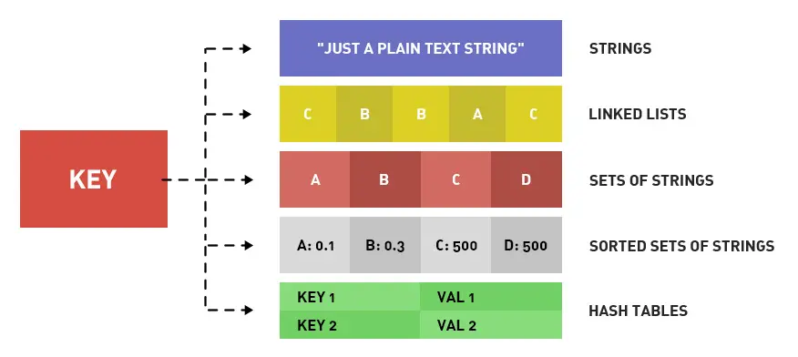
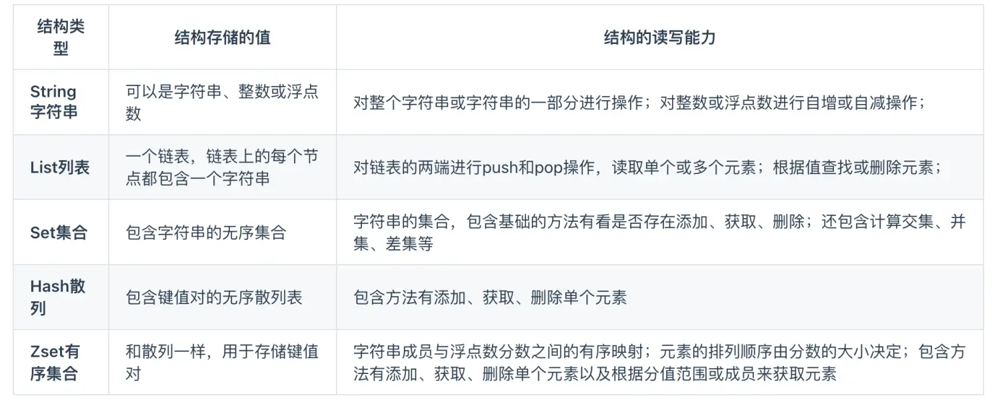

# Redis数据结构

Redis 提供了丰富的数据类型，常见的有五种数据类型：String（字符串），Hash（哈希），List（列表），Set（集合）、Zset（有序集合）。

随着 Redis 版本的更新，后面又支持了四种数据类型： BitMap（2.2 版新增）、HyperLogLog（2.8 版新增）、GEO（3.2 版新增）、Stream（5.0 版新增）。 Redis 五种数据类型的应用场景：

- String 类型的应用场景：缓存对象、常规计数、分布式锁、共享 session 信息等。
- List 类型的应用场景：消息队列（但是有两个问题：1. 生产者需要自行实现全局唯一 - ID；2. 不能以消费组形式消费数据）等。
- Hash 类型：缓存对象、购物车等。
- Set 类型：聚合计算（并集、交集、差集）场景，比如点赞、共同关注、抽奖活动等。
- Zset 类型：排序场景，比如排行榜、电话和姓名排序等。

Redis 后续版本又支持四种数据类型，它们的应用场景如下：

- BitMap（2.2 版新增）：二值状态统计的场景，比如签到、判断用户登陆状态、连续签到用户总数等；
- HyperLogLog（2.8 版新增）：海量数据基数统计的场景，比如百万级网页 UV 计数等；
- GEO（3.2 版新增）：存储地理位置信息的场景，比如滴滴叫车；
- Stream（5.0 版新增）：消息队列，相比于基于 List 类型实现的消息队列，有这两个特有的特性：自动生成全局唯一消息ID，支持以消费组形式消费数据。

## Redis数据结构内部实现

### String 类型内部实现

String 类型的底层的数据结构实现主要是 SDS（简单动态字符串）。 SDS 和我们认识的 C 字符串不太一样，之所以没有使用 C 语言的字符串表示，因为 SDS 相比于 C 的原生字符串：

SDS 不仅可以保存文本数据，还可以保存二进制数据。因为 SDS 使用 len 属性的值而不是空字符来判断字符串是否结束，并且 SDS 的所有 API 都会以处理二进制的方式来处理 SDS 存放在 buf[] 数组里的数据。所以 SDS 不光能存放文本数据，而且能保存图片、音频、视频、压缩文件这样的二进制数据。
SDS 获取字符串长度的时间复杂度是 O(1)。因为 C 语言的字符串并不记录自身长度，所以获取长度的复杂度为 O(n)；而 SDS 结构里用 len 属性记录了字符串长度，所以复杂度为 O(1)。
Redis 的 SDS API 是安全的，拼接字符串不会造成缓冲区溢出。因为 SDS 在拼接字符串之前会检查 SDS 空间是否满足要求，如果空间不够会自动扩容，所以不会导致缓冲区溢出的问题。
### List 类型内部实现

List 类型的底层数据结构是由双向链表或压缩列表实现的：

如果列表的元素个数小于 512 个（默认值，可由 list-max-ziplist-entries 配置），列表每个元素的值都小于 64 字节（默认值，可由 list-max-ziplist-value 配置），Redis 会使用压缩列表作为 List 类型的底层数据结构；
如果列表的元素不满足上面的条件，Redis 会使用双向链表作为 List 类型的底层数据结构；
但是在 Redis 3.2 版本之后，List 数据类型底层数据结构就只由 quicklist 实现了，替代了双向链表和压缩列表。

### Hash 类型内部实现

Hash 类型的底层数据结构是由压缩列表或哈希表实现的：

如果哈希类型元素个数小于 512 个（默认值，可由 hash-max-ziplist-entries 配置），所有值小于 64 字节（默认值，可由 hash-max-ziplist-value 配置）的话，Redis 会使用压缩列表作为 Hash 类型的底层数据结构；
如果哈希类型元素不满足上面条件，Redis 会使用哈希表作为 Hash 类型的底层数据结构。
在 Redis 7.0 中，压缩列表数据结构已经废弃了，交由 listpack 数据结构来实现了。

### Set 类型内部实现

Set 类型的底层数据结构是由哈希表或整数集合实现的：

如果集合中的元素都是整数且元素个数小于 512 （默认值，set-maxintset-entries配置）个，Redis 会使用整数集合作为 Set 类型的底层数据结构；
如果集合中的元素不满足上面条件，则 Redis 使用哈希表作为 Set 类型的底层数据结构。
ZSet 类型内部实现

### Zset 类型的底层数据结构是由压缩列表或跳表实现的：

如果有序集合的元素个数小于 128 个，并且每个元素的值小于 64 字节时，Redis 会使用压缩列表作为 Zset 类型的底层数据结构；
如果有序集合的元素不满足上面的条件，Redis 会使用跳表作为 Zset 类型的底层数据结构；
在 Redis 7.0 中，压缩列表数据结构已经废弃了，交由 listpack 数据结构来实现了。