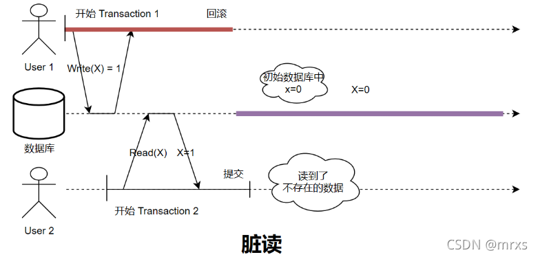
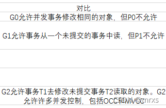

# 事务隔离级别

https://www.nebula-graph.com.cn/posts/transaction-isolation

https://nan01ab.github.io/2017/08/ANSI-SQL-Isolation-Levels.html

## 一、概述

隔离级别是设计数据库系统的重要要求。对于事务来说，按照既定顺序一个接一个地执行，那么数据库最终一定会得到一个确定的正确的结果。然而，这样的实现对于现如今的系统来说代价太大。严格地顺序执行意味着事务之间的并发度为0，导致系统的性能不佳。

我们知道，并不是所有的系统都要求事务达到一个强的正确性的顺序，只要能够提供一个一致性的状态，可以适当降低对事务正确性的要求。因此，我们需要一个能够提供不同要求的分级标准，根据应用的需求，来设计数据库系统不同隔离级别的实现，从而在满足应用要求的同时，也能够尽可能的提高系统性能。

一个好的隔离级别的定义有两个目标：（1）正确。每个级别的定义，应该能够将所有损害该级别想要保证的正确性的情况排除在外。也就是说，只要实现满足某一隔离级别定义，就一定能获得对应的正确性保证。（2）实现无关。常见的并发控制的实现方式包括，锁、OCC以及多版本 。而一个好的标准不应该限制其实现方式。

隔离级别的定义比较复杂。最开始的时候是根据能够避免不同的异象来判定隔离等级。但是由于异象的定义存在歧义，从而出现了基于锁实现的异象的定义。但后来的证明发现，基于锁的异象太严格，且与实现方式相关，不能为OCC以及MVCC所适用。因此，提出了基于序列化图的异象定义，并给出了更多的隔离级别。

针对快照隔离，后来提出了快照可序列化的概念，又在SSI上扩展了这项工作。最终，在PG中实现了可序列化。后面，A Critique of Snapshot Isolation 指出SSI bootstrapping算法可以简化。

## 二、弱一致性的隔离级别[9]：首次提出

通过牺牲可串行化来提高系统性能。

### (一)具体的Degree与锁对应

|||
|--|--|
|Degree 0|短写锁|
|Degree 1|长写锁|
|Degree 2|长写锁 & 短读锁|
|Degree 3|长写锁 & 长读锁|
	
### (二)不足

- 与实现相关：这些隔离级别的实现都是与锁的实现相关的。

- 没有考虑基于谓词的操作。

- 不支持OCC & MVCC的实现。

## 三、ANSI SQL标准(1992)：基于异象

ANSI SQL提出了非形式化的定义，规定了每个隔离级别的某些类型的行为或者现象。一个完全可串行化的系统不允许出现所有情况，而较低的隔离级别阻止了其中的一些情况，但允许其他情况。

ANSI SQL标准定义了不同的异象，并根据不同的能够避免异象的多少来划分不同的隔离级别。

### (一) 异象

#### (1)脏读：一个事务读到了另一个事务还没提交的中间值。

#### (2)不可重复读： 一个事务中连续读取同一个值时返回结果不一样（中途被其他事务更改了）。

#### (3)幻读：当一个事务按照条件C检索出一批数据，还未结束。另外的事务写入了一个新的满足条件C的数据，使得前一个事务检索的数据集不准确。

### (二) 隔离级别

根据阻止不同的异象，划分了四种隔离级别。

### (三)不足

这些定义和隔离级别虽然看起来比较清晰，与实现无关。但还是有不足。

- 正确性：缺少对于Dirty Write的排除[8]。

- 只是说明了单版本的对象，缺少对MVCC的解释。

- ANSI SQL对异象的定义表述存在歧义[8]。

## 三、A Critique of ANSI(1995)[8]：基于锁

### (一) ANSI中的两种解释分析

- w: write
- r: read 
- c: commit
- a: abort

由读取(read)、写入(write),提交(commit)和中止(abort)组成的历史记录可以用简写符号表示：
- w1 [x]: 表示事务1怼数据项x的写入，数据项被修改；
- r2 [x]：表示事务2对x的读取。
- 事务1满足谓词P的读取和写入一组记录分别由r1 [P]和w1 [P]表示。
- 同理，事务1的提交和中止分别被记为c和a相同的方法表示。

#### 1.基于异常的解释 & 基于预测的解释对比

#### 2.ANSI基于预测解释的基于锁的实现（严格）

### (二) 重新定义的异常情况[10]

#### P0（Dirty Write）:w1[x]…w2[x]…(c1 or a1)。
事务 T1 先修改了数据 x，接着事务 T2 在事务 T1 提交或者回滚前又修改了 x，如果之后不管事务 T1 提交或者回滚了，数据的约束关系（比如 x=y 的约束）都很难维护起来。P0 是 ANSI SQL-92 中没有描述的一种异常现象，但因为很难保证事务一致性，因此作者认为所有隔离级别都应该避免 P0。

#### P1（Dirty Read）:w1[x]…r2[x]… (c1 or a1)。
只要事务 T2 读到了正在执行的事务 T1 写入的数据，后面不管事务 T1、T2 是提交还是取消，就认为这个 Transaction History 属于 Dirty Read，而不是像 A1 那样，还要看事务是否 T1 回滚 T2 提交。如果某个事务隔离级别能够避免 P1，那么它一定也能同时避免 A1。

#### A1 (Dirty Read): w1[x]…r2[x]…(a1 and c2 in any order)：事务 T1 先修改 x 的值，事务 T2 之后读取 x 的值，读到了事务 T1 未提交的修改值，之后事务 T1 回滚，T2 提交。

#### P2 （Non-Repeatable Read）:r1[x]…w2[x]…(c1 or a1)。
只要事务 T2 修改了在这之前事务 T1 读到过的数据，后面不管事务 T1、T2 是提交还是回滚，就认为这个 Transaction History 属于 Non-Repeatable Read。如果某个事务隔离级别能够避免 P2，那么它一定也能同时避免 A2。另外从 P4 和 P4C 的定义来看，它们都存在一个事物先读 x 另一个事物再写 x 这种事务历史，所以这种能避免 P2 的事务隔离级别也一定能避免 P4 和 P4C。

#### **A2 (Non-Repeatable Read): r1[x]…w2[x]…c2…r1[x]…c1。事务 T1 先读 x 的值，接着事务 T2 修改了 x 或者删除了 x 的值并提交，之后事务 T1 再读一遍 x 的值，要么 x 的值和之前不一致，要么读不到 x 了。

#### P3（Phantom）:r1[P]…w2[y in P]…(c1 or a1)。
和 A3 类似，事务 T1 先根据过滤条件 读取数据，事务 T2 接着新增了满足刚才过滤条件 的数据并提交，后面不管事务 T1、T2 是提交还是回滚，就认为这个 Transaction History 属于 Phantom。如果某个事务隔离级别能够避免 P3，那么它一定也能同时避免 A3。

#### P4（Lost Update）: r1[x]…w2[x]…w1[x]…c1。
事务 T2 对 x 的修改被事务 T1 后续对 x 的修改覆盖了，之后事务 T1 提交，从外界看来，事务 T2 对 x 的修改丢失了。

#### P4C（Lost Update）: rc1[x]…w2[x]…w1[x]…c1。
P4 的 Cursor 版本。在基于锁的事务并发控制中，通过对 Cursor 中的读锁进行特殊处理可以实现 Cursor Stability：读锁会一直持有到当前 Cursor 中，直到 Cursor 移动到下一个事务操作时才释放。如果是读满足某个条件的数据，只会上 Short Duration Predicate Lock，读完立马释放。当然，写的时候仍然需要上 Long Duration Write Lock。

当一个事务使用游标访问一个对象，而不是在读完后立即释放读锁，T保留读锁，直到游标从对象上移除或者T提交。如果T更新对象，锁就会升级为写锁。这种方法可以防止丢失更新的问题。

#### A3（Phantom）:r1[P]…w2[y in P]…c2…r1[P]…c1。
和 A2类似，不过这次事务 T1 先根据过滤条件 读取数据，事务 T2 接着新增了满足刚才过滤条件 的数据并提交，之后事务 T1 再次根据过滤条件 读一遍数据，结果和之前不一致。

#### A5A（Read Skew）:r1[x]…w2[x]…w2[y]…c2…r1[y]…(c1 or a1)。
事务 T1 先读了 x 的值，然后事务 T2 接着又更新了 x 和 y 的值并提交。这种情况下，T1 再去读 y 可能就会看到 x 和 y 不满足约束条件的现象。

#### A5B（Write Skew）:r1[x]…r2[y]…w1[y]…w2[x]…(c1 and c2)。
事务 T1 先读了 x 和 y 的值，发现满足约束条件，然后事务 T2 也读了 x 和 y，更新了 x 后再提交，接着事务 T1 如果更新 y 的值再提交。两个事务执行完后就可能发生 x 和 y 之间的约束被打破的情况。

### (三) 隔离级别

### (四) 快照的概念：

首先提出SI：
事务的读操作从Committed快照中读取数据，快照时间可以是事务的第一次读操作之前的任意时间，记为StartTimestamp
事务准备提交时，获取一个CommitTimestamp，它需要比现存的StartTimestamp和CommitTimestamp都大
事务提交时进行冲突检查，如果没有其他事务在[StartTS, CommitTS]区间内提交了与自己的WriteSet有交集的数据，则本事务可以提交；这里阻止了Lost Update异常
SI允许事务用很旧的StartTS来执行，从而不被任何的写操作阻塞，或者读一个历史数据；当然，如果用一个很旧的CommitTS提交，大概率是会Abort的

## 四、A Generalized Theory(1999)[7]：基于序列化图

### (一) 基于图

- 写写冲突ww（Directly Write-Depends）：表示两个事务先后修改同一个数据库Object(w1[x]…w2[x]…)；
- 先写后读冲突wr（Directly Read-Depends）：一个事务修改某个数据库Object后，另一个对该Object进行读操作（w1[x]…r2[x]…）；
- 先读后写冲突rw（Directly Anti-Depends）：一个事务读取某个Object或者某个Range后，另一个事务进行了修改（r1[x]…w2[x]… or r1[P]…w2[y in P]）；

DSG图

USG图

SSG图

SUSG图

LDSG图

### (二) 异象定义

G0：

G1:

G2:

G-single:

G-SI:

G-MSR:

G-cursor(x):

G-update:

G-monotonic:

### (三) 隔离级别

## 五、SSI（2009）[4]
Fekete 在 Serializable Isolation for Snapshot Databases的论文。Adya和Fekete的研究发现一个定理：在序列化历史图里的每一个环路都存在着T1 -> T2 -> T3读写反依赖关系，其中，T3一定是这个环里的事务中最先提交的事务。串行化快照隔离（SSI, Serializable Snapshot Isolation，也会被翻译为序列化快照）是基于SI改进达到Serializable级别的隔离性。

Multi-Version的串行图中，增加一种称之为RW依赖的边，即事务T1先写了一个版本，事务T2读了这个版本，则产生RW依赖。当这个图产生环时，则违背了Serializable。

Fekete证明，SI产生的环中，两条RW边必然相邻，也就意味着会有一个pivot点，既有出边也有入边。那么只要检测出这个pivot点，选择其中一个事务abort掉，自然就打破了环的结构。

算法的核心就在于动态检测出这个结构，因此会在每个事务记录一些状态，为了减少内存使用，使用inConflict和outConflict两个bool值来记录；在事务执行读写操作的过程中，会将与其他事务的读写依赖记录于这两个状态中。虽然用bool值减少了内存使用，但显然也增加了false positive，会导致一部分没有异常的事务被abort。从理论模型看，SSI性能接近SI，远远好于S2PL，abort较低，给Snapshot Isolation带来的开销也比较小。

SSI保留了SI的很多优点，特别是读不阻塞任何操作，写不会阻塞读。事务依然在快照中运行，但增加了对事务间读写冲突的监控用于识别事务图（transaction graph）中的危险结构。当一组并发事务可能产生异常现象，系统将通过回滚其中某些事务进行干预以消除异常发生的可能。这个过程虽然会导致某些事务的错误回滚（不会导致anomaly的事务被误杀），但可以确保消除异常。

这篇论文基本上遵循这个想法，除了这些检查不是在应用程序代码中编写的，而是在数据库级别进行检查。所以你不必撕掉你的事务处理引擎，但你可以在另一组检查上分层，并且你可以使你的数据库可序列化。

## 六、SSI在PG中实现[5]
《Serializable Snapshot Isolation in PostgreSQL》在 PostgreSQL 中实现它，而 Postgres 终于具有可序列化性。PostgreSQL的SSI实现，为了减少内存占用仍需要不少的工作量。

2012年，PostgreSQL在9.1版本中实现了SSI，可能也是首个支持SSI的商业数据库，验证了SSI的实现效果。CockroachDB也从Cahill的论文获得灵感，实现SSI并将其作为其默认隔离级别。

随着技术的发展，SI/SSI已经成为主流数据库的隔离技术，尤其是后者的出现，无需开发人员在代码通过显式锁来避免异常，从而降低了人为错误的概率。

## 七、Write-SI：
《A Critique of Snapshot Isolation》

CockroachDB的文章里提到，WSI的思路对他们产生了很大启发；而Badger则是直接使用了这个算法，实现了支持事务的KV引擎。

之所以critique snapshot isolation，因为Basic Snapshot Isolation给人造成了一种误导：『进行写写冲突检测是必须的』。文章开篇即提出，SI中的LostUpdate异常，不一定需要阻止WW冲突；换成RW检测，允许WW冲突，既能够阻止LostUpdate异常，同时能够实现Serializable，岂不美哉？

为何WW检测不是必须的？非形式化地思考一下，在MVCC中，写冲突的事务写的是不同的版本，为何一定会有冲突；实际上只有两个事务都是RW操作时才有异常，如果其中一个事务事务只有W操作，并不会出现Lost Update；换言之，未必要检测WW冲突，RW冲突才是根源所在。

基于RW冲突检测的思想，作者提出Write Snapshot Isolation，将之前的Snapshot Isolation命名为Read Snapshot Isolation。例如图中：

TXNn和TXNc’有冲突，因为TXNc’修改了TXNn的ReadSet

TXNn和TXNc没有冲突，虽然他们都修改了r’这条记录，Basic SI会认为有冲突，但WriteSI认为TXNc没有修改TXNn的ReadSet，则没有RW冲突

如何检测RW冲突：事务读写过程中维护ReadSet，提交时检查自己的ReadSet是否被其他事务修改过。但实际也不会这么简单，因为通常维护ReadSet的开销比WriteSet要大，且这个冲突检查如何做，难道加读锁？所以在原文中，作者只解释了中心化的WSI如何实现，至于去中心化的实现，可从Cockroach找到一点影子。

不过RW检测会带来很多好处：

只读事务不需要检测冲突，它的StartTS和CommitTS一样

只写事务不需要检测冲突，它的ReadSet为空

更重要的是，这种算法实现的隔离级别是Serializable而不是Snapshot Isolation。

## 八、参考文献：

1.A History of Transaction Histories

2.数据库内核月报 － 2018 / 10 Database · 理论基础 · 数据库事务隔离发展历史

3.Isolation综述

4.Serializable Isolation for Snapshot Databases (简：Serializable Isolation for Snapshot Databases)

5.Serializable Snapshot Isolation in PostgreSQL

6.A Critique of Snapshot Isolation

7.weak consistency:A Generalized Theory and Optimistic Implementations for Distributed Transactions （简：Generalized Isolation Level Definitions）

8.A Critique of ANSI SQL Isolation Levels

9.Granularity of Locks and Degrees of Consistency in a Shared Database

10.A Critique of ANSI SQL Isolation Levels 阅读笔记

https://zhuanlan.zhihu.com/p/377298306

https://www.cnblogs.com/lovezhr/p/15517668.html

https://developer.aliyun.com/article/77965

https://www.microsoft.com/en-us/research/wp-content/uploads/2016/02/tr-95-51.pdf

https://nan01ab.github.io/2017/08/ANSI-SQL-Isolation-Levels.html

https://blog.csdn.net/FEATHER2016/article/details/120142986

https://news.sohu.com/a/570346625_612370