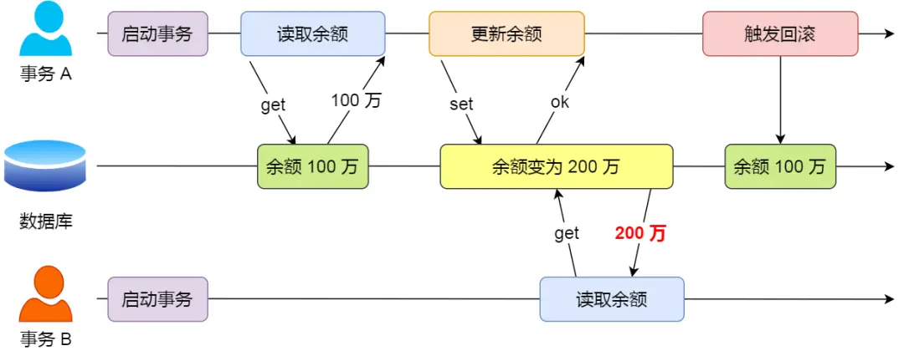

# 事务

事务，由一个有限的数据库操作序列构成，这些操作要么全部执行,要么全部不执行，是一个不可分割的工作单位。目的是为了保证数据的最终一致性。

## 事务的四个特性ACID

- 原子性（Atomicity）
事务作为一个整体被执行，包含在其中的对数据库的操作要么全部都执行，要么都不执行。
- 一致性（Consistency）
指在事务开始之前和事务结束以后，数据不会被破坏。
假如A账户给B账户转10块钱，不管成功与否，A和B的总金额是不变的。
- 隔离性（Isolation）
多个事务并发访问时，事务之间是相互隔离的，一个事务不应该被其他事务干扰，多个并发事务之间要相互隔离。
- 持久性（Durability）
表示事务完成提交后，该事务对数据库所作的操作更改，将持久地保存在数据库之中

InnoDB 引擎通过什么技术来保证事务的这四个特性的呢？

- 持久性是通过 redo log （重做日志）来保证的；
- 原子性是通过 undo log（回滚日志） 来保证的；
- 隔离性是通过 MVCC（多版本并发控制） 或锁机制来保证的；
- 一致性则是通过持久性+原子性+隔离性来保证；

## 事务并发存在的问题

- 脏读（dirty read）：读到其他事务未提交的数据；
- 不可重复读（non-repeatable read）：前后读取的数据不一致；
- 幻读（phantom read）：前后读取的记录数量不一致。

### 脏读

**如果一个事务「读到」了另一个「未提交事务修改过的数据」，就意味着发生了「脏读」现象。**

假设有 A 和 B 这两个事务同时在处理，事务 A 先开始从数据库中读取小林的余额数据，然后再执行更新操作，如果此时事务 A 还没有提交事务，而此时正好事务 B 也从数据库中读取小林的余额数据，那么事务 B 读取到的余额数据是刚才事务 A 更新后的数据，即使没有提交事务。

因为事务 A 是还没提交事务的，也就是它随时可能发生回滚操作，如果在上面这种情况事务 A 发生了回滚，那么事务 B 刚才得到的数据就是过期的数据，这种现象就被称为脏读。

### 不可重复读

**在一个事务内多次读取同一个数据，如果出现前后两次读到的数据不一样的情况，就意味着发生了「不可重复读」现象。**

假设有 A 和 B 这两个事务同时在处理，事务 A 先开始从数据库中读取小林的余额数据，然后继续执行代码逻辑处理，在这过程中如果事务 B 更新了这条数据，并提交了事务，那么当事务 A 再次读取该数据时，就会发现前后两次读到的数据是不一致的，这种现象就被称为不可重复读。

### 幻读

**如果一个事务先根据某些搜索条件查询出一些记录，在该事务未提交时，另一个事务写入了一些符合那些搜索条件的记录（如insert、delete、update），就意味着发生了幻读。**
**在一个事务内多次查询某个符合查询条件的「记录数量」，如果出现前后两次查询到的记录数量不一样的情况，就意味着发生了「幻读」现象。**

假设有 A 和 B 这两个事务同时在处理，事务 A 先开始从数据库查询账户余额大于 100 万的记录，发现共有 5 条，然后事务 B 也按相同的搜索条件也是查询出了 5 条记录。

接下来，事务 A 插入了一条余额超过 100 万的账号，并提交了事务，此时数据库超过 100 万余额的账号个数就变为 6。

然后事务 B 再次查询账户余额大于 100 万的记录，此时查询到的记录数量有 6 条，发现和前一次读到的记录数量不一样了，就感觉发生了幻觉一样，这种现象就被称为幻读。

## 解决事务并发问题-隔离级别

为了解决并发事务存在的脏读、不可重复读、幻读等问题，数据库大叔设计了四种隔离级别。分别是读未提交，读已提交，可重复读，串行化（Serializable）。

- 读未提交
读未提交隔离级别，只限制了两个数据不能同时修改，但是修改数据的时候，即使事务未提交，都是可以被别的事务读取到的；
这级别的事务隔离有脏读、重复读、幻读的问题。
- 读已提交
读已提交隔离级别，当前事务只能读取到其他事务提交的数据。
所以这种事务的隔离级别解决了脏读问题，但还是会存在重复读、幻读问题。
- 可重复读
可重复读隔离级别，限制了读取数据的时候，不可以进行修改，所以解决了重复读的问题。
但是读取范围数据的时候，是可以插入数据，所以还会存在幻读问题；
- 串行化
事务最高的隔离级别，在该级别下，所有事务都是进行串行化顺序执行的。可以避免脏读、不可重复读与幻读所有并发问题。但是这种事务隔离级别下，事务执行很耗性能。

|隔离级别|脏读|不可重复读|幻读|
|--|--|--|--|
|读未提交|√|√|√|
|读已提交|×|√|√|
|可重复读|×|×|√|
|串行化|×|×|×|

- 对于「读未提交」隔离级别的事务来说，因为可以读到未提交事务修改的数据，所以直接读取最新的数据就好了；
- 对于「串行化」隔离级别的事务来说，通过加读写锁的方式来避免并行访问；
- 对于「读提交」和「可重复读」隔离级别的事务来说，它们是通过 Read View 来实现的，它们的区别在于创建 Read View 的时机不同，大家可以把 Read View 理解成一个数据快照，就像相机拍照那样，定格某一时刻的风景。「读提交」隔离级别是在「每个语句执行前」都会重新生成一个 Read View，而「可重复读」隔离级别是「启动事务时」生成一个 Read View，然后整个事务期间都在用这个 Read View。

MySQL 在「可重复读」隔离级别下，可以很大程度上避免幻读现象的发生（注意是很大程度避免，并不是彻底避免），所以 MySQL 并不会使用「串行化」隔离级别来避免幻读现象的发生，因为使用「串行化」隔离级别会影响性能。

MySQL InnoDB 引擎的默认隔离级别虽然是「可重复读」，但是它很大程度上避免幻读现象（并不是完全解决了，详见），解决的方案有两种：

- 针对快照读（普通 select 语句），是通过 MVCC 方式解决了幻读，因为可重复读隔离级别下，事务执行过程中看到的数据，一直跟这个事务启动时看到的数据是一致的，即使中途有其他事务插入了一条数据，是查询不出来这条数据的，所以就很好了避免幻读问题。
- 针对当前读（select ... for update 等语句），是通过 next-key lock（记录锁+间隙锁）方式解决了幻读，因为当执行 select ... for update 语句的时候，会加上 next-key lock，如果有其他事务在 next-key lock 锁范围内插入了一条记录，那么这个插入语句就会被阻塞，无法成功插入，所以就很好了避免幻读问题。

## 总结

当多个事务并发执行的时候，会引发脏读、不可重复读、幻读这些问题，那为了避免这些问题，SQL 提出了四种隔离级别，分别是读未提交、读已提交、可重复读、串行化，从左往右隔离级别顺序递增，隔离级别越高，意味着性能越差，InnoDB 引擎的默认隔离级别是可重复读。

要解决脏读现象，就要将隔离级别升级到读已提交以上的隔离级别，要解决不可重复读现象，就要将隔离级别升级到可重复读以上的隔离级别。

而对于幻读现象，不建议将隔离级别升级为串行化，因为这会导致数据库并发时性能很差。MySQL InnoDB 引擎的默认隔离级别虽然是「可重复读」，但是它很大程度上避免幻读现象（并不是完全解决了，详见这篇文章 (opens new window)），解决的方案有两种：

- 针对快照读（普通 select 语句），是通过 MVCC 方式解决了幻读，因为可重复读隔离级别下，事务执行过程中看到的数据，一直跟这个事务启动时看到的数据是一致的，即使中途有其他事务插入了一条数据，是查询不出来这条数据的，所以就很好了避免幻读问题。
- 针对当前读（select ... for update 等语句），是通过 next-key lock（记录锁+间隙锁）方式解决了幻读，因为当执行 select ... for update 语句的时候，会加上 next-key lock，如果有其他事务在 next-key lock 锁范围内插入了一条记录，那么这个插入语句就会被阻塞，无法成功插入，所以就很好了避免幻读问题。

对于「读提交」和「可重复读」隔离级别的事务来说，它们是通过 Read View 来实现的，它们的区别在于创建 Read View 的时机不同：

READ COMMITTD、REPEATABLE READ这两个隔离级别的一个很大不同就是生成ReadView的时机不同，READ COMMITTD在每一次进行普通SELECT操作前都会生成一个ReadView，而REPEATABLE READ只在第一次进行普通SELECT操作前生成一个ReadView，之后的查询操作都重复这个ReadView就好了。

-「读提交」隔离级别是在每个 select 都会生成一个新的 Read View，也意味着，事务期间的多次读取同一条数据，前后两次读的数据可能会出现不一致，因为可能这期间另外一个事务修改了该记录，并提交了事务。

-「可重复读」隔离级别是启动事务时生成一个 Read View，然后整个事务期间都在用这个 Read View，这样就保证了在事务期间读到的数据都是事务启动前的记录。
这两个隔离级别实现是通过「事务的 Read View 里的字段」和「记录中的两个隐藏列」的比对，来控制并发事务访问同一个记录时的行为，这就叫 MVCC（多版本并发控制）。

在可重复读隔离级别中，普通的 select 语句就是基于 MVCC 实现的快照读，也就是不会加锁的。而 select .. for update 语句就不是快照读了，而是当前读了，也就是每次读都是拿到最新版本的数据，但是它会对读到的记录加上 next-key lock 锁。

https://xiaolincoding.com/mysql/transaction/mvcc.html

### [隔离级别扩展](./txn-isolation.md)

