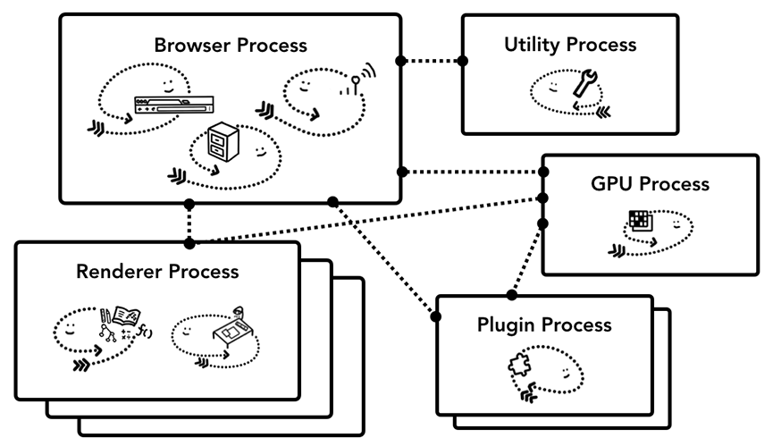

# Chrome

Chrome以多进程架构运行。

主要进程
浏览器进程，渲染进程，GPU进程，网络进程，插件进程

浏览器进程
主要负责界面显示、用户交互、子进程管理，同时提供存储等功能。控制应用程序的“ chrome”部分，包括        地址栏，书签，后退和前进按钮, 还处理Web浏览器的隐形，特权部分，例如网络请求和文件访问。

渲染进程
核心任务是将 HTML、CSS 和 JavaScript 转换为用户可以与之交互的网页，排版引擎 Blink 和 JavaScript 引擎 V8 都是运行在该进程中，默认情况下，Chrome 会为每个 Tab 标签创建一个渲染进程。出于安全考虑，渲染进程都是运行在沙箱模式下。

GPU 进程
其实，Chrome 刚开始发布的时候是没有 GPU 进程的。而 GPU 的使用初衷是为了实现 3D CSS 的效果是        随后网页、Chrome 的 UI 界面都选择采用 GPU 来绘制，这使得 GPU 成为浏览器普遍的需求。最后，            Chrome 在其多进程架构上也引入了 GPU 进程。

网络进程
主要负责页面的网络资源加载，之前是作为一个模块运行在浏览器进程里面的，直至最近才独立出来，成为        一个单独的进程。

插件进程
主要是负责插件的运行，因插件易崩溃，所以需要通过插件进程来隔离，以保证插件进程崩溃不会对浏览器        和页面造成影响。

utility进程
有时候浏览器主进程需要做一些“危险”的事情，比如图片解码、文件解压缩。如果这些“危险”的操作发生了失败，会导致整个主进程发生异常崩溃，这是我们不愿意看到的。因此Chromium设计出了一个utility进程的机制。主进程临时需要做一些不方便的任务的情况下，可以启动一个utility进程来代替主进程执行，主进程与utility进程之间通过IPC消息来通信。

如果当前在资源充足的环境下还会有如下其他进程

UI进程
存储进程
设备进程
Audio进程
Video进程
Profile进程

节省内存 - Chrome的服务化
Chrome 将浏览器的每个部分拆分为不同的服务，这样方便拆分和组合。当硬件设备比较好时Chrome将服务拆分到不同的进程中运行可以保证稳定性；在设备不那么好的设备上，Chrome将服务整合到同一个进程中这样可以节约内存。

单帧渲染进程 - 站点隔离
我们现在知道了Chrome为每个tab都单独起了一个进程，这样产生的问题是如果一个网页中嵌入了多个跨站点的iframe，不同站点之间共享内存空间，这样会产生安全隐患。同源策略是网络的核心安全模型；它确保一个站点未经同意无法访问其他站点的数据。绕过此策略是安全攻击的主要目标。基于进程之间相互隔离的特点，进程隔离是分离站点的最有效方法，Chrome 67以后默认启用站点隔离，选项卡中的每个跨站点 iframe 都有一个单独的渲染器进程。