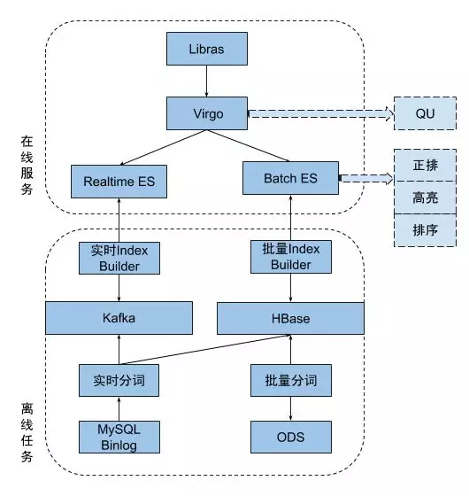
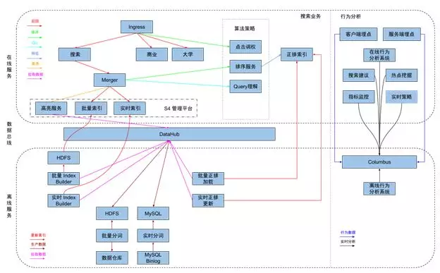

https://www.6aiq.com/article/1549118463410#google_vignette

https://cloud.tencent.com/developer/article/1793053

一、知乎搜索工程架构的演进
1.初代搜索

知乎自建搜索起步于2016年，此前知乎的搜索构建于搜狗提供的技术方案。随着业务高速增长，索引时效性、排序质量和内容多样性等定制化需求越发突出，公司决定搭建自己的搜索业务。初代的知乎搜索，解决的是从无到有的问题，因此选用ElaticSearch来搭建。从16年8月份开始，历史半年密集开发，搜索团队搭建起了知乎的第一代搜索。随着初代搜索逐步放量得益于对自己内容质量更深刻的理解，搜索各项业务指标都开始逐步提升。

2.搜索现状

在初代搜索全量几个月后，搜索系统的稳定性、代码模块过度耦合，严重影响开发效率以及流水线数据质量的稳定性，我们开始规划对初代搜索进行第一次大规模的重构。经过 2018 年一年的工作，我们利用从初代搜索积累下来的经验，将原有系统所有的组件基本上都重新设计和开发了一遍。虽然模块数量明显增加，但是得益于模块和模块之间边界更清晰的划分，整个系统的可维护性更高且更易于理解。

在新架构上线完成后，以往很可能需要数月开发上线周期的多源召回和基于点击调权的混排策略得以在更短的时间内开发上线，完成放量。配合公司成熟的 AB 测试平台，算法团队的策略迭代效率得到了极大的提升。

本轮迭代工期拉的最长的是搜索引擎部分。我们使用 Rust 重写了一套同 Lucene 索引格式兼容的搜索系统，逐步的替换掉了 ElasticSearch，同时将原本倒排、正排和排序集成在一体巨大的单体服务分拆成多个独立的服务分别维护。一方面每个服务更加专注也很好的控制了代码量的规模，再加上 Rust 无 GC 的特点，最终整体服务的稳定性、可维护性和可管理性都得到了很大的进步。

为了屏蔽数据流水线批量和增量两个数据源的事实，我们还基于HDFS 和 MySQL 搭建了新一代的数据流水线DataHub。为用户暴露出来一个版本单调递增的文档数据流，流水线的消费者可以用更简单的方式来消费流水线的数据，由 DataHub 自动决定是完全以增量还是以批量加增量的方式恢复状态。

3.继续完善

经过 2018 年的大规模重构，知乎搜索的稳定性和迭代效率有了质的提升。但是我们也看到在效果上还有很大优化空间，在未来我们将会投入更多工作在排序质量和内容召回能力等方向。

https://rustmagazine.github.io/rust_magazine_2021/chapter_4/zhihu_simd_rucene.html

https://github.com/zhihu/rucene

https://geek.zshipu.com/post/%E4%BA%92%E8%81%94%E7%BD%91/%E7%9F%A5%E4%B9%8E%E6%90%9C%E7%B4%A2%E6%8E%92%E5%BA%8F%E6%A8%A1%E5%9E%8B%E7%9A%84%E6%BC%94%E8%BF%9B/