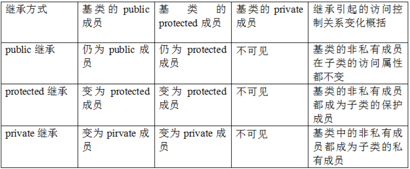

# 继承（单一继承、多重继承、多级继承、菱形继承、虚继承）

## 一、基类与派生类的概念

基类（父类）：在继承关系中处于上层的类
派生类（子类）：在继承关系中处于下层的类

```
class A;
class B;
class C:public A  //C为A的子类，A为C的父类
{
};
class D:public A,public B  //D为A和B的子类，A和B均为D的父类
{
};
```

## 二、类派生列表

派生类通过派生类列表来指出其从哪个（哪些）基类继承而来

类派生列表的使用规则：
①派生列表不能出现在类的声明时，只能在定义时，原因如下：
一条声明语句的目的是让程序知晓某个名字的存在已经改名字表示一个什么样的实体（如一个类、一个函数、或一个变量等）

https://juejin.cn/post/7156612705430798367

https://cloud.tencent.com/developer/article/1784573

https://github.com/guaguaupup/cpp_interview/blob/main/C%2B%2B.md



