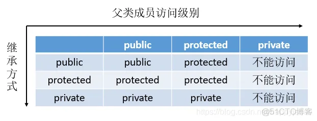

# C++

## 三种继承方式public,protected,private

C++ 中支持三种继承方式：公有继承，私有继承，保护继承，C++ 中的默认访问属性为 private

公有继承（public）

- 基类的 public 和 protected 成员的访问属性在派生类中保持不变，但基类的 private 成员不可直接访问。
- 派生类中的成员函数可以直接访问基类中的 public 和 protected 成员，但不能直接访问基类的 private 成员。
- 通过派生类的对象只能访问基类的 public 成员。

保护继承（protected）

- 基类的 public 和 protected 成员都以 protected 身份出现在派生类中，但基类的 private 成员不可直接访问。
- 派生类中的成员函数可以直接访问基类中的 public 和 protected 成员，但不能直接访问基类的 private 成员。
- 通过派生类的对象不能直接访问基类中的任何成员

私有继承（private）

- 基类的 public 和 protected 成员都以 private 身份出现在派生类中，但基类的 private 成员不可直接访问。
- 派生类中的成员函数可以直接访问基类中的 public 和 protected 成员，但不能直接访问基类的 private 成员。
- 通过派生类的对象不能直接访问基类中的任何成员。



```
#include<iostream>
using namespace std;

class Parent
{
protected:
    int m_a;
protected:
    int m_b;
public:
    int m_c;
    void set(int a, int b, int c)
    {
        m_a = a;
        m_b = b;
        m_c = c;
    }
};
class Child_A : public Parent
{
public:
    void print()
    {
        cout << "m_a = " << m_a << endl;
        cout << "m_b = " << m_b << endl;
        cout << "m_c = " << m_c << endl;
    }
};
class Child_B : protected Parent
{
public:
    void print()
    {
        cout << "m_a = " << m_a << endl;
        cout << "m_b = " << m_b << endl;
        cout << "m_c = " << m_c << endl;
    }
};
class Child_C : private Parent
{
public:
    void print()
    {
        cout << "m_a = " << m_a << endl;
        cout << "m_b = " << m_b << endl;
        cout << "m_c = " << m_c << endl;
    }
};

int main()
{
    Child_A a;
    Child_B b;
    Child_C c;
    a.m_c = 100;
    a.set(1, 1, 1);
    
    a.print();
    b.print();
    c.print();
    return 0;
}
```

## 重载、重写、隐藏的区别

### 重载（Overloading）

重载是指相同作用域(比如命名空间或者同一个类)内拥有相同的方法名，但具有不同的参数类型和/或参数数量的方法。 重载允许根据所提供的参数不同来调用不同的函数。它主要在以下情况下使用：

- 方法具有相同的名称。
- 方法具有不同的参数类型或参数数量。
- 返回类型可以相同或不同。
- 同一作用域，比如都是一个类的成员函数，或者都是全局函数

```
class OverloadingExample {
  void display(int a) {
    System.out.println("Display method with integer: " + a);
  }

  void display(String b) {
    System.out.println("Display method with string: " + b);
  }
}
```

### 重写（Overriding）

重写是指在派生类中重新定义基类中的方法。

当派生类需要改变或扩展基类方法的功能时，就需要用到重写。

重写的条件包括：

- 方法具有相同的名称。
- 方法具有相同的参数类型和数量。
- 方法具有相同的返回类型。
- 重写的基类中被重写的函数必须有virtual修饰。
- 重写主要在继承关系的类之间发生。

例如:

```
#include <iostream>

class BaseClass {
public:
    virtual void display() {
        std::cout << "Display method in base class" << std::endl;
    }
};

class DerivedClass : public BaseClass {
public:
    void display() override {
        std::cout << "Display method in derived class" << std::endl;
    }
};

int main() {
    DerivedClass derived;
    derived.display();

    return 0;
}
```

### 隐藏（Hiding）

隐藏是指派生类的函数屏蔽了与其同名的基类函数。注意只要同名函数，不管参数列表是否相同，基类函数都会被隐藏。 示例:

```
#include<iostream>
using namespace std;

classA{
public:
  void fun1(int i, int j){
    cout <<"A::fun1() : " << i <<" " << j << endl;
  }
};
classB : public A{
public:
  //隐藏
  void fun1(double i){
    cout <<"B::fun1() : " << i << endl;
  }
};
int main(){
  B b;
  b.fun1(5);//调用B类中的函数
  b.fun1(1, 2);//出错，因为基类函数被隐藏
  system("pause");
  return 0;
}
```

## C++ 类对象的构造和析构顺序

### 为什么 C++ 构造函数不能是虚函数？

### 为什么 C++ 基类析构函数需要是虚函数？

### 虚析构函数

假设基类中采用的是非虚析构函数，当删除基类指针指向的派生类对象时就不会触发动态绑定，因而只会调用基类的析构函数，而不会调用派生类的析构函数。

【注意】如果基类的析构函数不是虚函数，则delete一个指向派生类对象的基类指针将产生歧义。

https://www.cnblogs.com/sunbines/p/9215305.html

### C++ 析构函数可以抛出异常吗？

首先，从语法层面 C++ 并没有禁止析构函数抛出异常，但是实践中建议不要这样做。

## C++ 深拷贝和浅拷贝

### 浅拷贝（Shallow Copy）
浅拷贝是一种简单的拷贝方式，它仅复制对象的基本类型成员和指针成员的值，而不复制指针所指向的内存。

这可能导致两个对象共享相同的资源，从而引发潜在的问题，如内存泄漏、意外修改共享资源等。

一般来说编译器默认帮我们实现的拷贝构造函数就是一种浅拷贝。

POD(plain old data) 类型的数据就适合浅拷贝，对于 POD的理解可以看下这篇class和struct的区别(opens new window)

简单来说，浅拷贝也可以理解为直接按 bit 位复制，基本等价于 memcpy()函数。

### 深拷贝（Deep Copy）

深拷贝不仅复制对象的基本类型成员和指针成员的值，还复制指针所指向的内存。

因此，两个对象不会共享相同的资源，避免了潜在问题。

深拷贝通常需要显式实现拷贝构造函数和赋值运算符重载。

## C++多态的实现方式

C++实现多态的方法主要包括**虚函数、纯虚函数和模板函数**

其中虚函数、纯虚函数实现的多态叫动态多态，模板函数、重载等实现的叫静态多态。

区分静态多态和动态多态的一个方法就是看决定所调用的具体方法是在编译期还是运行时，运行时就叫动态多态。


