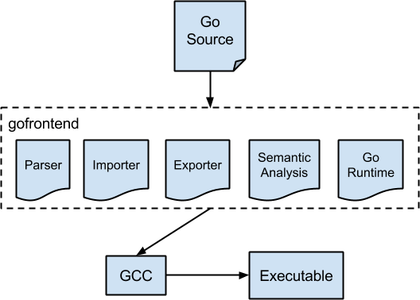

# Golang

## Compile

Gccgo 作为 GCC（GNU 编译器集合）的一部分进行分发。 GCC 支持不同语言的几种前端。 gccgo 是连接到 GCC 后端的 Go 前端。 Go 前端与 GCC 项目是分开的，旨在能够连接到其他编译器后端，但目前仅支持 GCC。
与 gc 相比，gccgo 编译代码的速度较慢，但支持更强大的优化，因此 gccgo 构建的受 CPU 约束的程序通常运行速度更快。多年来，在 GCC 中实现的所有优化都是可用的，包括内联，循环优化，向量化，指令调度等。尽管它并不总是能产生更好的代码，但在某些情况下，使用 gccgo 编译的程序可以运行 30％更快。
gc 编译器仅支持最受欢迎的处理器：x86（32 位和 64 位）和 ARM。但是，Gccgo 支持 GCC 支持的所有处理器。并非所有这些处理器都经过了 gccgo 的全面测试，但是许多处理器都进行了测试，包括 x86（32 位和 64 位），SPARC，MIPS，PowerPC 甚至 Alpha。 Gccgo 还已经在 gc 编译器不支持的操作系统（尤其是 Solaris）上进行了测试。
Gccgo 提供了标准的，完整的 Go 库。 Go 运行时的许多核心功能在 gccgo 和 gc 中都相同，包括 goroutine 调度程序，通道，内存分配器和垃圾收集器。 Gccgo 和 gc 编译器一样，支持拆分 goroutine 堆栈，但目前仅在 x86（32 位或 64 位）上，并且仅在使用 gold 链接器时（在其他处理器上，每个 goroutine 将具有较大的堆栈，以及一系列深层次的函数调用可能会运行到堆栈末尾并使程序崩溃）。

https://golang.design/under-the-hood/zh-cn/part2runtime/ch06sched/mpg/

## Release History

https://www.cnblogs.com/garvenc/p/18133242/go_document_release_history

泛型
go1.22.0 (2024-02-06)
每次range循环创建新变量。
CPU性能提升1–3%，内存减少约1%。
启用PGO可提升2-14%。
增加math/rand/v2包。
增强net/http.ServeMux的路由功能。
go1.21.0 (2023-08-08)
增加min、max、clear内置函数。
明确包初始化顺序。
增加log/slog、slices、maps、cmp包。
go1.20 (2023-02-01)
编译支持PGO。
go1.19 (2022-08-02)
go1.18 (2022-03-15)
引入泛型。
模糊测试。
支持工作区。
切片扩容算法的大小分界从1024改为256。
模块
go1.17 (2021-08-16)
完善模块机制。
程序运行时性能提升5%，二进制程序体积减少2%。
go1.16 (2021-02-16)
模块感知模式默认启用。
支持内嵌文件。
链接速度加快20-25%，内存减少5-15%，使Go链接器更现代化。
弃用io/ioutil包。
go1.15 (2020-08-11)
二进制程序体积减少5%。
链接器速度加快20%，内存减少30%，使Go链接器更现代化。
go1.14 (2020-02-25)
模块机制可用于生产。
引入RISC-V支持。
defer几乎零开销。
重新实现定时器。
go1.13 (2019-09-03)
改进数值字面量语法。
完善模块机制。
defer性能提高30%。
errors包增加函数As、Is、Unwrap。
go1.12 (2019-02-25)
完善模块机制。
go1.11 (2018-08-24)
引入WebAssembly支持。
引入模块机制。
go1.10 (2018-02-16)
构建缓存。
测试缓存。
重写编译器和运行时
go1.9 (2017-08-24)
类型别名。
并行编译。
使用单调时钟。
go1.8 (2017-02-16)
编译器和链接器速度提升15%。
支持插件。
GC通常低于100毫秒，平常低于10毫秒。
defer的开销减半。
Go调用C的开销减半。
支持HTTP/2推送。
go1.7 (2016-08-15)
正式支持vendor。
编译器加入SSA。
程序运行时CPU提升5-35%，二进制程序体积减少20-30%。
增加context包。
go1.6 (2016-02-17)
定义CGo在Go和C之间共享指针的规则。
支持HTTP/2。
go1.5 (2015-08-19)
正式支持internal内部包。
自举，完全替换C代码。
重写编译器和运行时，不再使用6g/8g、6a/8a、6l/8l等工具链。
stop the world基本在10毫秒以下。
可编译动态共享库。
Go 1正式发布
go1.4 (2014-12-10)
支持规范化的导入路径。
go1.3 (2014-06-18)
垃圾收集器更精确。
go1.2 (2013-12-01)
协程创建时的栈大小从4K改为8K。
go1.1 (2013-05-13)
go1 (2012-03-28)
Go 1兼容性保证。

## Go runtime

https://golang.design/under-the-hood/zh-cn/part2runtime/ch07alloc/pagealloc/