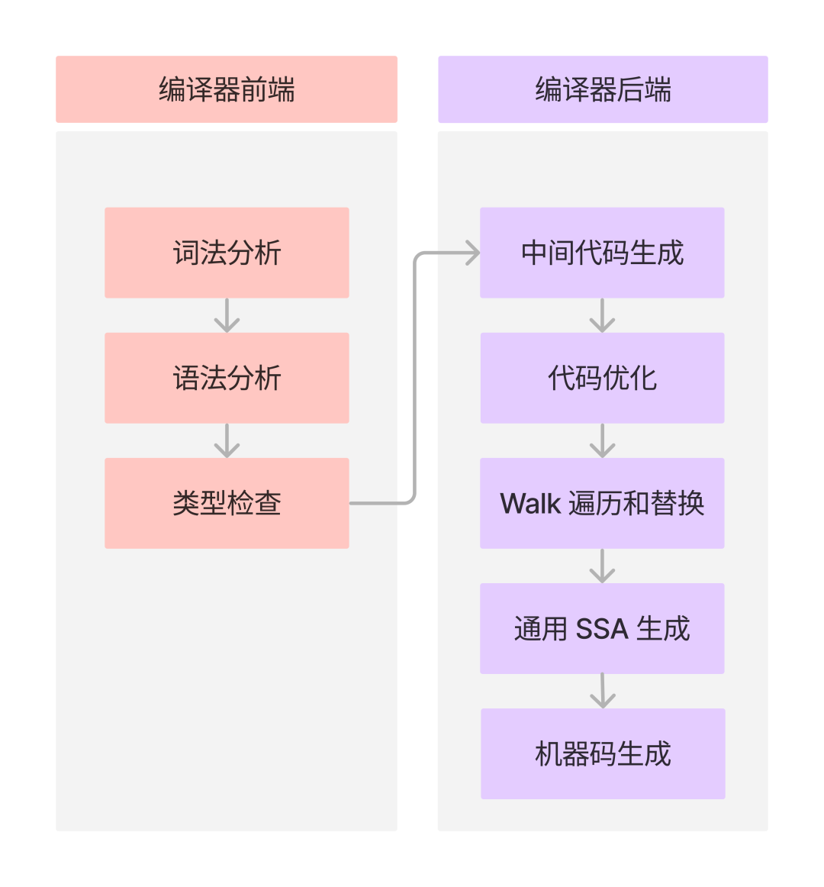
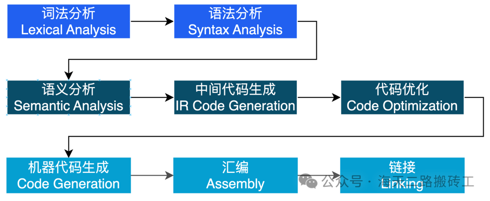

# Go 编译器

## Go compiler 实现

编译器本身也是一个程序，它的作用就是把一个以某种语言（源语言）编写的程序 翻译 成等价的另一个语言（目标语言）编写的程序。

而编译器这个程序本身的编写与编程语言是没有关系的，任何一种图灵完备的语言都可以编写任何一种形式语言的编译器。

最开始的 Go compiler （Go 1.4 以及之前）是由 C 和汇编共同编写的，等到 2015 年时 Google 开始公布实现 Go 1.5 自举的计划[1]。

首先使用 Go 语言编写一个和之前用 C 语言编写的 Go compiler 一样功能的程序出来，再用之前用 C 语言实现好的 Go compiler 来编译这个新写的程序，这样就得到一个用 Go 语言实现的 Go compiler 。后续的 Go 程序就都可以直接使用这个新的用 Go 语言实现的 Go compiler 来编译了。

这种用源语言自身来实现源语言的编译器的做法就叫自举。所以在 Go 1.5 及之后的 Go compiler 就是用 Go 语言自身实现的了。

## Go compiler 组成

Go 语言编译器的源代码在 src/cmd/compile 目录中。

Go语言的编译器主要由以下几个模块组成，每个模块对应Go源码中的不同部分：

- 前端（Frontend）:
    - 词法分析器（Lexer）: 负责将源代码文本分解成一系列的标记（tokens）。在Go源码中，这部分通常位于src/cmd/compile/internal/syntax目录。
    - 语法分析器（Parser）: 负责解析标记并构建抽象语法树（AST）。这部分的代码也位于src/cmd/compile/internal/syntax目录。
    - 类型检查器（Type Checker）:负责对AST进行遍历，检查和推断表达式和变量的类型。这部分的代码位于src/cmd/compile/internal/types和src/cmd/compile/internal/typecheck目录。
    - 中间代码生成器（Intermediate Code Generator）:将AST转换为中间表示（IR），通常是静态单赋值（SSA）形式。这部分的代码位于src/cmd/compile/internal/ssa目录。
    - 优化器（Optimizer）:对IR进行优化，以提高代码的运行效率。优化器的代码同样位于src/cmd/compile/internal/ssa目录，因为很多优化都是在SSA形式上进行的。
- 后端（Backend）:
    - 代码生成器（Code Generator）: 负责将优化后的IR转换为目标平台的机器代码。这部分的代码根据不同的目标平台（如AMD64、ARM等）分布在src/cmd/compile/internal/ssa/gen目录下的不同子目录中。
    - 寄存器分配（Register Allocator）: 在代码生成过程中，负责为变量分配寄存器或栈空间。这部分的代码也位于src/cmd/compile/internal/ssa目录。
    - 链接器（Linker）:负责将编译器输出的目标代码与其他库或模块链接，生成最终的可执行文件。链接器的代码位于src/cmd/link目录。

## 编译过程

- 预处理（Preprocessing）: 这一步骤在一些编程语言中非常重要，比如C/C++，它涉及宏替换、条件编译等。在Go语言中，由于设计哲学的不同，没有传统意义上的预处理步骤，但是会有类似的导入路径解析和文件加载过程。
- 词法分析（Lexical Analysis）: 编译器的词法分析器将源代码文本分解成一系列的标记（tokens），如关键字、标识符、字面量、操作符等。
- 语法分析（Syntax Analysis）: 语法分析器解析标记流并构建抽象语法树（AST），这是源代码逻辑结构的树状表示。
- 语义分析（Semantic Analysis）: 在这一步骤中，编译器进行类型检查，确保变量和表达式的使用符合类型系统的要求，并可能进行一些初步的代码优化。
- 中间代码生成（Intermediate Code Generation）: 编译器将AST转换为中间表示（IR），通常是静态单赋值（SSA）形式，这是一种既适合进一步优化也便于转换为目标代码的代码形式。
- 优化（Optimization）: 编译器对IR进行优化，以提高代码的运行效率。优化可以在不同的层次进行，包括局部优化和全局优化。
- 代码生成（Code Generation）: 编译器将优化后的IR转换为目标机器代码，这是特定于目标平台的低级代码。
- 汇编（Assembly）: 汇编器将编译器生成的机器代码转换为目标平台的汇编语言，然后再将其转换为机器语言。
- 链接（Linking）: 链接器将编译器和汇编器生成的目标代码文件与所需的库文件合并，解决符号引用，生成最终的可执行文件。

## Reference

https://golang.design/under-the-hood/zh-cn/part2runtime/ch06sched/mpg/

https://qcrao91.gitbook.io/go/bian-yi-he-lian-jie/go-bian-yi-lian-jie-guo-cheng-gai-shu#yu-yi-fen-xi

https://blog.csdn.net/kevin_tech/article/details/131016335

https://cloud.tencent.com/developer/article/2401918

https://cloud.tencent.com/developer/article/2401918