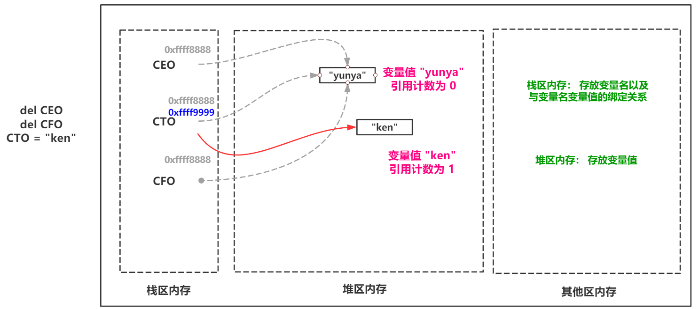

# Python 内存模型

## Python中的内存管理

私有堆：Python 的内存分配是从私有堆上进行的。这个堆内存包含了所有 Python 对象和数据结构。

引用计数机制：Python 内部使用引用计数来跟踪每个对象的引用数量。当引用计数归零时，即对象不再被引用时，该内存就可以被回收。但这种机制有一个主要缺点：它不会处理引用循环。

垃圾回收：

除了引用计数，Python 还有一个垃圾收集器，用于收集引用计数机制无法处理的引用循环。
Python 的垃圾回收机制主要使用了“分代收集”策略，将对象分为三代。新创建的对象是第0代，经历过一次垃圾收集且未被清除的对象移动到第1代，以此类推。大多数的垃圾收集会在第0代上进行，这使得Python的垃圾收集效率非常高。
内存池机制：对于小块的内存分配，Python 采用了内存池的机制，这有助于提高内存分配的效率。这种机制通过为相似大小的对象重新利用内存块来避免频繁的系统调用。

内置的gc模块：Python 提供了gc模块，使开发者能够与垃圾收集机制互动。例如，你可以使用gc.collect()来手动触发垃圾回收。

对象的专用分配器：对于常用的对象如整数、浮点数、列表和字典，Python 使用了专用的快速分配器，这有助于提高对象分配和释放的速度。

引用周期和__del__方法：Python 的垃圾收集器处理引用循环，但对于定义了__del__方法的对象，可能会存在问题，因为__del__方法可能会意外地重新引用对象，导致其不被正确清理。

手动内存管理：尽管 Python 为对象管理提供了自动的内存分配和回收，但在某些情况下，开发者可能需要手动管理资源，例如文件或网络连接。这通常是通过上下文管理器和with语句，或明确的关闭方法来完成的。

python的对象管理主要位于Level+1~Level+3层
Level+3层：对于python内置的对象（比如int,dict等）都有独立的私有内存池，对象之间的内存池不共享，即int释放的内存，不会被分配给float使用
Level+2层：当申请的内存大小小于256KB时，内存分配主要由 Python 对象分配器（Python’s object allocator）实施
Level+1层：当申请的内存大小大于256KB时，由Python原生的内存分配器进行分配，本质上是调用C标准库中的malloc/realloc等函数

https://www.biaodianfu.com/garbage-collector.html

https://www.cnblogs.com/wuyanzu123/p/14698070.html

https://juejin.cn/post/6856235545220415496

https://juejin.cn/post/7022474622901682213#heading-2

https://juejin.cn/post/7057818996199931935

https://www.cnblogs.com/traditional/p/13695846.html

https://cloud.tencent.com/developer/article/1670455

https://www.cs.cmu.edu/~chenxia/2017/06/20/Python-memory-management/

## Python内存布局

程序代码区：这部分内存存放了程序的二进制代码。当程序启动时，程序的二进制代码就加载到这个区域。这部分内存是只读的，以避免程序在运行时意外地修改其自己的指令。

程序数据区：这部分包括了全局和静态变量的存储空间。程序数据区又可以进一步划分为以下几个子区：

初始化数据区：存放了程序中已初始化的静态变量和全局变量。
未初始化数据区：存放了程序中未初始化的静态变量和全局变量。为了安全起见，这部分内存通常会被系统初始化为0。

堆区（Heap）：堆是用于动态内存分配的区域。当你在 Python 中创建一个新的对象，如列表、字典或自定义对象时，这些对象的数据都会在堆上分配空间。堆的大小是动态的，会根据程序的需求进行增长或收缩。

栈区（Stack）：

栈是用于函数调用管理的区域。每次函数被调用时，都会为该函数分配一个新的栈帧，用于存放该函数的局部变量、参数和返回地址。
栈是后进先出（LIFO）的数据结构，当一个函数返回时，其对应的栈帧会被弹出。
递归调用可能导致大量的栈帧被推到栈上，如果递归过深，可能导致栈溢出。
自由存储区：这部分内存由 malloc、realloc、calloc 等 C 语言函数分配，但在 Python 中，你不太可能直接与之交互，除非你在使用某些特定的 C 扩展。

常量区：字符串和其他常量值被存放在这个区域。这部分内存是只读的，防止程序在运行时修改常量的值。

特殊区：这部分内存用于存储指令指针和控制寄存器等特殊用途的数据。

Python代码在运行是，Python解释器会向操作系统申请运行内存，将代码加载到内存中运行，如图所示：

Python 解释器为了利用好有限的内存空间，将内存进行了如图的划分：

## 不可变类型 – 内存模型

不可变类型：数据在内存中一旦创建，就不能修改了。
Python 为了优化程序执行速度，将字符串、整数定义成了不可变类型，一旦声明出来，数据就不能修改了。

### 字符串操作

字符串是内存中使用特别的多的数据，所以 Python对字符串进行了优化，字符串是不可变数据类型，所以不能直接修改字符串内部的数据。
当我们通过变量修改数据时，内存中将变量指向了一个新的内存地址。原来的字符串数据依然存在，并没有修改。

### 整数操作

整数和字符串一样，在程序中也是一个经常操作的数据。所以也对整数进行了优化，Python 解释器在加载的时候，将 -5~256 的整数直接在内存中创建好了开发人员要使用的时候直接使用即可，不需要创建对象。
整数也是不可变数据，如果需要修改变量中的整数数据时，就是将变量指向了一个新的内存地址，原来在内存中的数据不会收到影响。

## 可变类型 – 内存模型

可变类型就是可以修改数据内部的数据，如列表
Python 中的列表可以存储多个数据，存储的多个数据可能要参与业务处理需要经常变化，所以列表中的数据在语法上被定义成了可以修改的数据。如图所示：

# Cpython内存模型

https://blog.51cto.com/u_16213711/8319468

# Python内存管理机制之垃圾回收机制GC

## (1)引用计数(变量值被变量名关联的次数)

引用计数增加：
x = 10  # 10引用计数为1
y = x  # 10引用计数为2
引用计数减少：
x = 20 # 10的引用计数为1
del y  # 10的引用计数为0
值的引用计数一旦变为0，其占用的内存地址就应该被解释器的垃圾回收机制回收
优点：简单、直观实时性，只要没有了引用就释放资源。
缺点：循环引用时，无法回收

## (2)标记/清除(用于循环引用导致的内存泄漏问题)

标记/清除算法的核心：如果一个值没有关联任何一条以直接引用作为出发点的引用，那么该值就会被标记下来，并且清除
如果一个变量值不存在任何以栈区为出发点的引用，那么标记/清除算法就认为它是垃圾
标记/清除算法的做法:当应用程序可用的内存空间被耗尽的时，就会停止整个程序，然后进行两项工作，第一项则是标记，第二项则是清除

如果一个变量值不存在任何以栈区为出发点的引用，那么标记/清除算法就认为它是垃

## (3)分代回收

在历经多次扫描的情况下，都没有被回收的变量，gc机制就会认为，该变量是常用变量，gc对其扫描的频率会降低
  优点：降低扫描数数量，提升效率
  缺点: 有个别数据无法得到及时的处理

## 参考

https://www.cnblogs.com/wsnan/p/15899945.html

https://blog.51cto.com/u_15704423/10092047

https://www.cnblogs.com/Yunya-Cnblogs/p/12805512.html

Python虚拟机 https://1dayday.github.io/2020/09/01/python-virtual-machine-framework.html

https://blog.csdn.net/weixin_43844521/article/details/132156592

https://www.cnblogs.com/ChiRou/p/14905067.html

